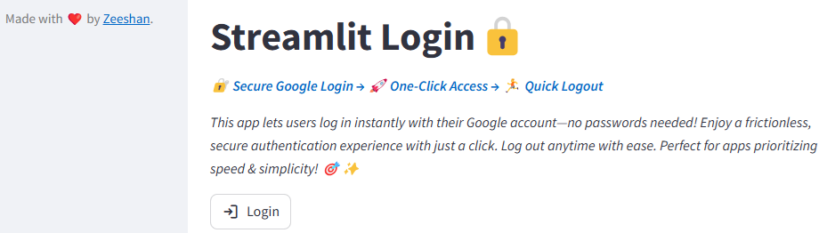
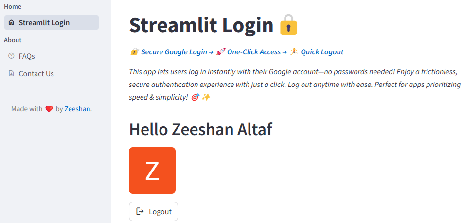

# Streamlit Login
🔐 Secure Google Login → 🚀 One-Click Access → 🏃 Quick Logout

This app lets users log in instantly with their Google account—no passwords needed! Enjoy a frictionless, 
secure authentication experience with just a click. Log out anytime with ease. Perfect for apps prioritizing 
speed & simplicity! 🎯✨

# Application Link
    -

# Technologies Used
* Streamlit -- Front end development
* Google Auth -- For authorization with Google Auth platform

   
# System Requirements
You must have Python 3.11 or later installed.

# Installation
1. Clone this repository
2. Create a virtual environment
3. Install the necessary python packages:
   `pip install -r requirements.txt`
4. Run the application with following command from terminal:

   `streamlit run app.py`

# Screen Shots

